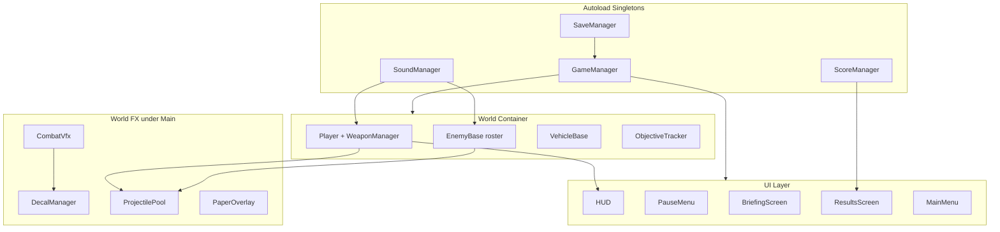
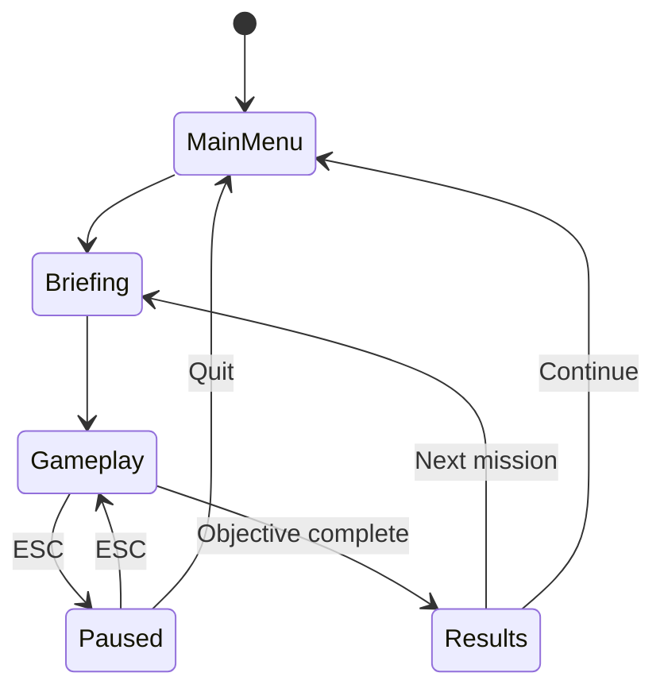
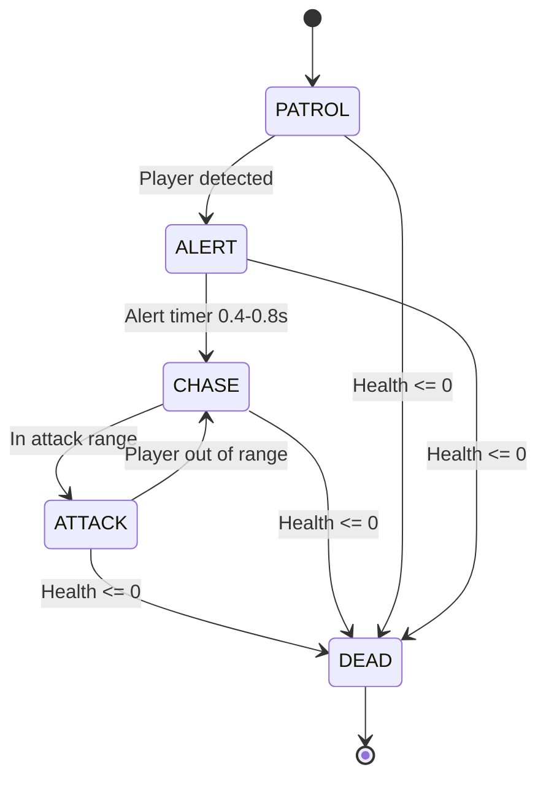

# Technical Architecture

## System Diagram

## Game State Flow

## Enemy State Machine

## Core Systems Detail

### Player System

`CharacterBody2D` with modular rig (`ShadowSprite` / `LegsSprite` / `TorsoContainer`):

- WASD movement, mouse-aim torso, dodge-roll i-frames
- Health + armor, grenades/mines, checkpoint save/restore
- Death lock until respawn; screen shake respects settings

### Weapon System

`WeaponManager` manages 3 slots with **magazine + reserve** ammo:

- Reload draws from reserve; pistol unlimited
- Ammo crates refill reserve; weapon pickups grant total rounds
- Per-weapon SFX via `SoundManager.play_weapon_shoot`

### Projectile Pools

- Player: 100-bullet pool on Player
- Enemy/vehicle: `ProjectilePool` on `Main/Projectiles` (80+)
- Rockets/grenades instantiate under Projectiles and are freed on mission exit

### Combat VFX & Decals

- `CombatVfx`: muzzle flashes (capped lights), explosions, ricochets, blood/dust
- `DecalManager`: FIFO 250 blood/scorch/casings/treads; cleared on mission exit

### Audio

- Buses: Master, Music (low-pass), SFX (low-pass)
- Crossfade music (title / tension / combat), ambient wind bed
- Pitch-varied per-weapon and impact SFX

### Objectives

`ObjectiveTracker` supports DESTROY / AREA / KILL_COUNT / SURVIVE with optional **sequential** gating.

### Collision Layers

| Layer | Name | Used By |
|-------|------|---------|
| 1 | Player | Player CharacterBody2D |
| 2 | Enemies | Enemy soldiers |
| 3 | PlayerBullets | Player projectiles |
| 4 | EnemyBullets | Enemy projectiles |
| 5 | Pickups | Health, ammo, weapons |
| 6 | Environment | Walls, sandbags, buildings |
| 7 | Vehicles | APC, Tank |

## Mission Titles (canonical)

Aligned with `GameManager.MISSION_NAMES` and the design spec:

1. First Thunder
2. Breaking the Line
3. Open Road
4. The Heart
5. Victory
