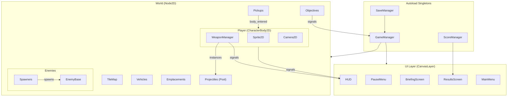
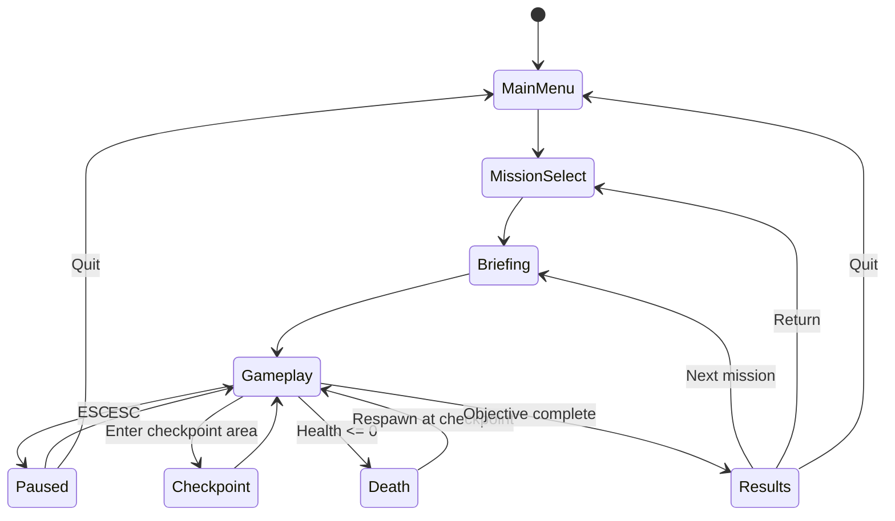
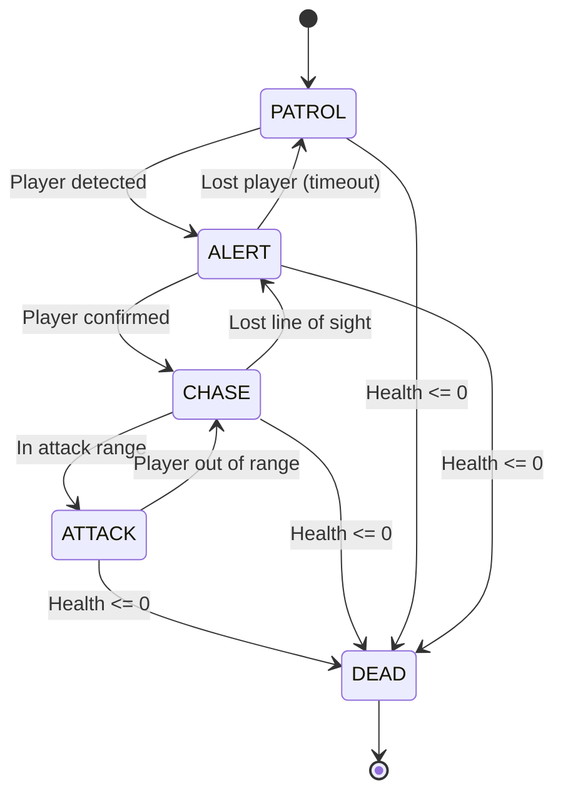

# Technical Architecture

## System Diagram



## Game State Flow



## Enemy State Machine



## Core Systems Detail

### Player System

The player is a `CharacterBody2D` that handles:

- **Movement**: Reads WASD input to build a velocity vector, normalizes for diagonal movement, applies to `move_and_slide()`
- **Rotation**: `look_at(get_global_mouse_position())` every physics frame
- **Dodge-roll**: On Space press, applies a burst velocity in the movement direction with 0.3s invincibility. 1.5s cooldown
- **Health**: Integer health pool, no regen. `take_damage()` emits `health_changed` signal for HUD

### Weapon System

`WeaponManager` is a child node of Player that manages:

- **3 slots**: Slot 1-2 (pickup weapons), Slot 3 (permanent pistol)
- **Firing**: Each weapon has fire_rate, damage, spread, projectile_scene, ammo_count
- **Switching**: 1/2/3 keys swap active weapon, updates sprite
- **Pickup**: When player enters a weapon pickup's Area2D, weapon is added to inventory (or swaps if full)

### Projectile Pool

- Pre-instantiate ~100 bullet nodes at mission start
- On fire: grab inactive bullet, set position/rotation/speed, activate
- On hit or off-screen: deactivate and return to pool
- Different projectile types for different weapons (speed, damage, sprite)

### Objective System

Objectives are `Area2D` trigger zones or enemy-count watchers:

- **Area objectives**: Player enters zone → objective complete
- **Kill objectives**: Track enemy deaths in an area, complete when count reached
- **Survive objectives**: Timer-based, survive until timer expires
- **Destroy objectives**: Specific target node destroyed → objective complete

Objectives emit signals to `GameManager`, which tracks mission progress and triggers transitions.

### Checkpoint System

- `Area2D` nodes placed at 2-3 points per mission
- On enter: saves player state (health, weapons, ammo, grenades, position)
- On death: restores saved state and respawns at checkpoint position
- Visual/audio feedback when checkpoint is reached

### Score System

Tracked per mission:

| Metric | Points |
|--------|--------|
| Enemy kill | +100 per kill |
| Vehicle destroyed | +500 per vehicle |
| Emplacement destroyed | +300 per emplacement |
| Accuracy bonus | Multiplier based on hit% |
| Time bonus | Points for fast completion |
| No-death bonus | +1000 if no deaths |

Letter ranks: A (90%+), B (70-89%), C (50-69%), D (<50%) of max possible score.

### Save System

Uses Godot's `ConfigFile` or `JSON` file saved to `user://save_data.json`:

```json
{
    "missions_unlocked": 3,
    "high_scores": {
        "mission_1": { "score": 15400, "rank": "A", "time": 185.5 },
        "mission_2": { "score": 12200, "rank": "B", "time": 240.0 }
    },
    "settings": {
        "music_volume": 0.8,
        "sfx_volume": 1.0,
        "screen_shake": true
    }
}
```
