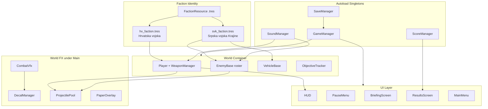
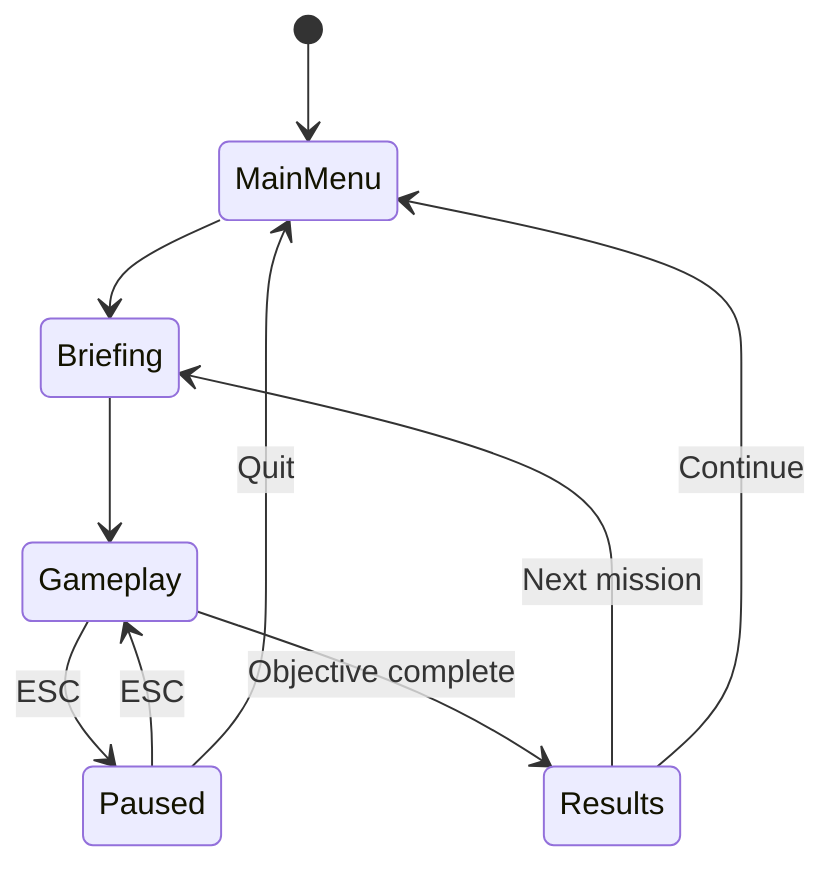
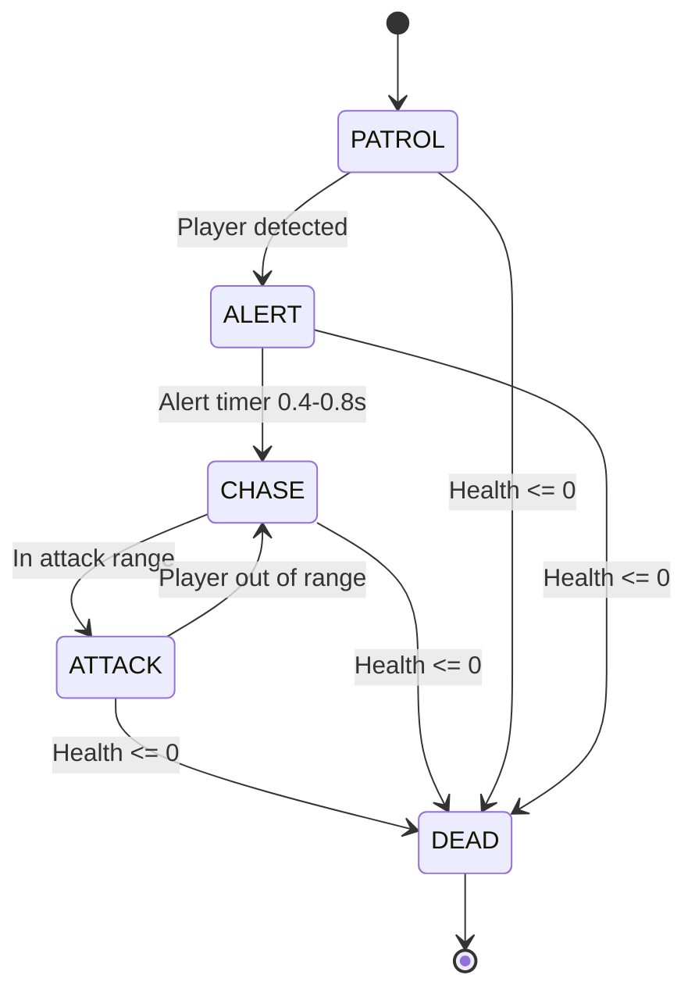

# Technical Architecture

## System Diagram

## Game State Flow

## Enemy State Machine

## Core Systems Detail

### Player System

`CharacterBody2D` with modular rig (`ShadowSprite` / `LegsSprite` / `TorsoContainer`):

- WASD movement, mouse-aim torso, dodge-roll i-frames
- Health + armor, grenades/mines, checkpoint save/restore
- Death lock until respawn; screen shake respects settings

### Weapon System

`WeaponManager` manages 3 slots with **magazine + reserve** ammo:

- Reload draws from reserve; pistol unlimited
- Ammo crates refill reserve; weapon pickups grant total rounds
- Per-weapon SFX via `SoundManager.play_weapon_shoot`

### Projectile Pools

- Player: 100-bullet pool on Player
- Enemy/vehicle: `ProjectilePool` on `Main/Projectiles` (80 base, 120 hard cap — blocks spawn when full)
- Rockets/grenades instantiate under Projectiles and are freed on mission exit

### Combat VFX & Decals

- `CombatVfx`: muzzle flashes (capped lights), explosions, ricochets, blood/dust; burning-wreck fire capped at 6 persistent emitters
- `DecalManager`: FIFO 250 blood/scorch/casings/treads; cleared on mission exit

### Audio

- Buses: Master, Music (low-pass), SFX (low-pass)
- Crossfade music (title / tension / combat), ambient wind bed
- Pitch-varied per-weapon and impact SFX

### Objectives

`ObjectiveTracker` supports DESTROY / AREA / KILL_COUNT / SURVIVE with optional **sequential** gating.

- Emits `objective_updated` on partial destroy progress and `objective_target_changed(targets, label)` when the active target set changes
- `get_current_targets()` returns the world `Node2D`s for the first incomplete positional objective
- `ObjectiveGuidance` binds the tracker to world `ObjectiveMarker` beacons + HUD `ObjectiveArrow` edge pointer
- Active markers join the `"objective"` / `"flag"` groups so the minimap draws gold blips
- Area objectives (`ExitZone`, `VillageZone`, `ApproachZone`) get visible zone banners via `MissionHelpers.add_zone_banner()`

### Faction System

`FactionResource` (`scripts/factions/FactionResource.gd`) is a data-driven resource defining a faction's `side` (HV/SVK), `display_name`, `short_name`, `flag_texture`, `insignia_texture`, `uniform_tint`, `accent_color`, and `unit_names` dictionary.

- `resources/factions/hv_faction.tres` — Hrvatska vojska (Croatian), šahovnica, olive-green tint
- `resources/factions/svk_faction.tres` — Srpska vojska Krajine (Serbian), tricolor, darker olive tint
- `EnemyBase` and `VehicleBase` default to SVK; `Player` defaults to HV
- Drives unit labels (`get_unit_label(unit_key)`), uniform modulate, armband/insignia sprites, and minimap blip colors

### Collision Layers

| Layer | Name | Used By |
|-------|------|---------|
| 1 | Player | Player CharacterBody2D |
| 2 | Enemies | Enemy soldiers |
| 3 | PlayerBullets | Player projectiles |
| 4 | EnemyBullets | Enemy projectiles |
| 5 | Pickups | Health, ammo, weapons |
| 6 | Environment | Walls, sandbags, buildings |
| 7 | Vehicles | APC, Tank |

## Mission Titles (canonical)

Aligned with `GameManager.MISSION_NAMES`, `GameManager.MISSION_META`, and the design spec:

1. First Thunder — Aug 4 dawn, Lika/Gospić, HV 9th Guards "Vukovi" / 4th Guards vs SVK 15th Lika Corps
2. Breaking the Line — Aug 4-5, Medak axis, HV 9th Guards "Vukovi" vs SVK 15th Lika Corps
3. Open Road — Aug 5, Sinj/Vrlika, HV armored spearhead vs SVK 7th Dalmatian Corps
4. The Heart — Aug 5 afternoon, Knin streets, HV 118th Brigade / 9th Guards vs SVK Knindže
5. Victory — Aug 5 evening, Knin Fortress, HV assault detachment vs final SVK garrison
